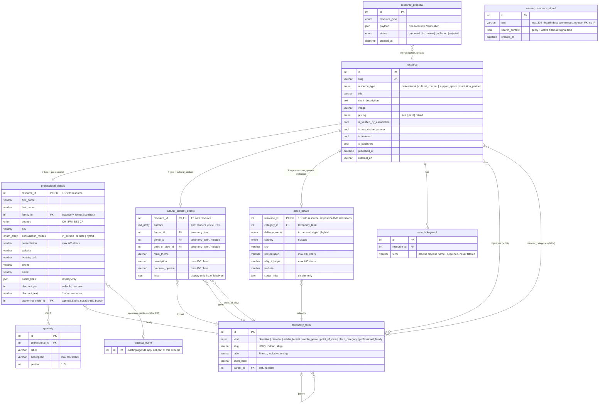
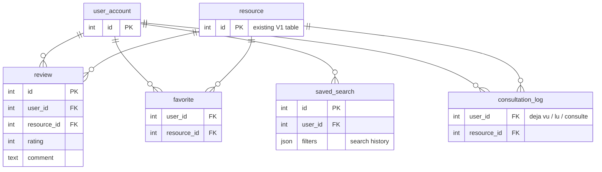

# Invisithèque — Data Model (production, E1 + E2)

PostgreSQL / Django schema for the full **E1 + E2** scope, mirroring the prototype's
`BaseResource` + detail shape (`prototype/lib/types.ts`). Étape 3 is shown separately,
as an extension that attaches without migrating anything.

Renders natively on GitHub; paste into [mermaid.live](https://mermaid.live) to export PNG/SVG.

## V1 schema (E1 + E2)

`missing_resource_signal` is deliberately unlinked: anonymous by design.

## Étape 3 extension (planned, not built)

Each E3 feature arrives as a new table with FKs to `resource` — nothing in the V1
schema needs migrating.

## Design decisions this schema encodes

1. **OneToOne detail tables** (not Django multi-table inheritance, not one wide table):
   per-type required fields stay enforceable, admin stays per-fiche, the search view is
   one query with three `select_related`.
2. **Fixed semantics = ENUM, client-editable wording = `taxonomy_term` row**: pricing,
   country, consultation/delivery modes are code; everything the workshop may rename
   (objectives, troubles, formats, genres, points de vue, familles, categories) is data,
   edited in the admin — no migration to change a label.
3. **JSON only where nothing filters**: social links and content links are display-only;
   every faceted dimension is a real column or M2M.
4. **No relevance score column**: E2 sorting is `ORDER BY` on the flags
   (`upcoming_circle_id IS NOT NULL`, `is_association_partner`, `is_featured`) then
   `published_at`; a scored model can be added later without touching the schema.
5. **E3-ready, not E3-built**: accounts, avis, favoris and « déjà vu » each land as new
   tables pointing at `resource`.
